# DataLoom 系统架构与技术实践

> 一个从零构建的在线 Excel 协作系统 —— 分块存储、混合保存、十万级数据流畅编辑

---

## 一、系统概览

### 1.1 这个项目是什么

DataLoom 是一个在线电子表格编辑器。你可以把它理解为一个部署在你本地或公司服务器上的、简化版的 Google Sheets 或 Microsoft 365 Excel。它支持上传 `.xlsx` / `.xls` 文件、在浏览器中像桌面 Excel 一样编辑、保存，然后再导出为标准的 Excel 文件。

"Loom" 是织布机。原始 Excel 文件中的数据、公式、样式，像一根根纱线，被系统拆解、分块、存储，再在前端重新编织成可编辑的在线表格 —— 这就是 DataLoom 这个名字的由来。

### 1.2 为什么要从零做

市面上的方案各有各的问题。Microsoft 365 和 Google Sheets 是 SaaS，数据要上云，在企业内网环境下合规过不了审批。企业版私有化部署少则六位数起步，而且太重——你不需要 90% 的功能，但必须为它们买单。开源的在线表格方案里，纯 Luckysheet 前端没有持久化能力，刷新页面数据全丢；如果后端直接把整表存成一个 JSON 字段，到了十万行级别数据库就撑不住了。

DataLoom 的思路很简单：用 Luckysheet 2.1.13 做前端编辑器，用 Spring Boot 做后端，数据按 1000 行一块拆开存进 H2 数据库。这样既保留了 Luckysheet 全套编辑能力（公式计算、合并单元格、格式刷、筛选排序、条件格式、插入图片和图表），又不让数据库背大 JSON 的锅。

### 1.3 技术栈

| 层 | 技术 | 角色 |
|---|------|------|
| 后端框架 | Spring Boot 2.1 | REST API 服务 |
| ORM | MyBatis-Plus 3.3 | 数据库访问层 |
| 数据库 | H2（文件模式） | 嵌入式数据库，零配置启动 |
| Excel 解析 | Apache POI 4.1 | 服务端解析上传的 Excel 文件 |
| 前端框架 | Vue 3.5 + Vite 6 | Composition API + ES Module |
| UI 组件 | Element Plus 2 | 页面框架组件库 |
| 表格引擎 | Luckysheet 2.1.13 | 类 Excel 在线编辑器（CDN 加载） |
| 图表渲染 | ECharts 4.8 | 图表面板渲染引擎 |
| 前端导出 | ExcelJS 4.4 | 客户端生成 `.xlsx` 文件 |

一个值得注意的细节是：项目中同时存在 Vue 2 和 Vue 3。DataLoom 主应用使用 Vue 3 Composition API + Vite ES Module 打包，但 Luckysheet 的图表插件 `chartmix` 是 2019 年写的 Vue 2 UMD 组件，它需要 `window.Vue` 全局变量。因此 `index.html` 中额外通过 CDN `<script>` 标签加载了一个 Vue 2.6.11 实例，**专门给图表插件使用**。两个 Vue 版本互不冲突 —— Vue 3 管理 `#app` 下的全部页面，Vue 2 只管理图表设置面板那个小弹窗。

---

## 二、数据库表结构

### 2.1 设计思路

在设计数据库之前，先想清楚一个问题：一个 Excel 文档包含哪些数据？

一份典型的 Excel 有多个 Sheet（页签），每个 Sheet 里有成千上万的单元格。除了单元格数据，还有合并单元格的配置、列宽行高、超链接、插入的图片、条件格式规则、图表等等。

如果把所有这些数据塞进一张表的一个 JSON 字段里，查询和更新都会极其痛苦——10 万行数据序列化成 JSON 轻松超过 30 MB，数据库的单行承载能力面临极限，更不用说并发编辑时的事务冲突。

解决方案是 **三层拆分**：

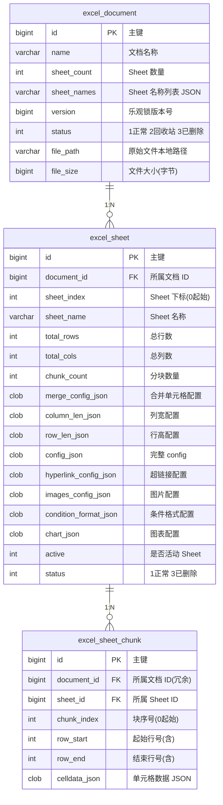

- **`excel_document`（文档主表）**：只存文档级的元信息——名称、Sheet 数量、原始文件路径、大小。不存任何单元格数据。
- **`excel_sheet`（Sheet 元信息表）**：存一个 Sheet 的全部结构配置——合并单元格规则、列宽、行高、超链接、图片、条件格式、图表。这些数据通常不大（单条记录几 KB 到几十 KB），直接放在一个 CLOB 字段里就够了。
- **`excel_sheet_chunk`（数据分块表）**：这是核心设计。一个 Sheet 的所有单元格数据 **不是**整体存一条记录，而是按 1000 行一块切分，每块独立存储。10 万行的 Sheet 产生 100 个 Chunk 记录，每个 Chunk 约 200~500 KB。

### 2.2 为什么是 1000 行一块

这个数字不是随便选的。一个典型表格约 26 列，1000 行 × 26 列 = 26,000 个单元格。每个单元格的 Luckysheet JSON 约 100~200 字节，单块约 2~5 MB。H2 的 CLOB 字段完全吃得消，HTTP 传输也在可接受范围。

如果每块太大（5000 行），一个单元格修改就要读 + 改 + 写约 13 万单元格的 JSON；如果每块太小（100 行），10 万行产生 1000 个 Chunk，查询和管理开销不可忽略。1000 是试出来的一个平衡点。

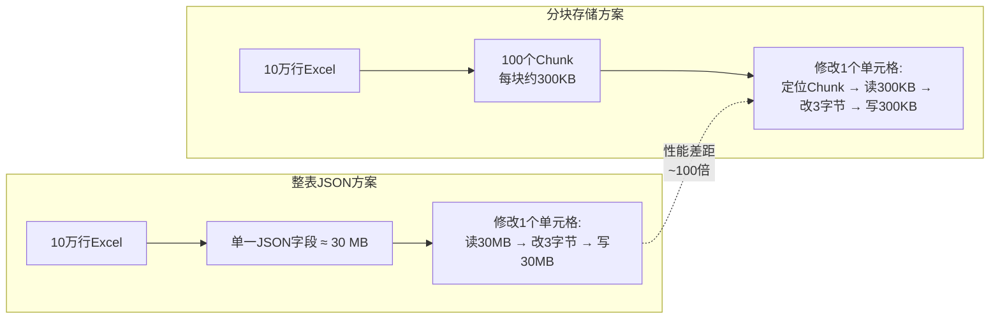

### 2.3 建表语句（H2 兼容）

```sql
-- 文档主表
CREATE TABLE IF NOT EXISTS excel_document (
    id              BIGINT AUTO_INCREMENT PRIMARY KEY,
    name            VARCHAR(255)   NOT NULL,
    sheet_count     INT            DEFAULT 0,
    sheet_names     VARCHAR(2000),
    version         BIGINT         DEFAULT 1,
    status          INT            DEFAULT 1,
    file_path       VARCHAR(500),
    file_size       BIGINT         DEFAULT 0,
    creator_id      VARCHAR(64)    DEFAULT 'demo-user',
    create_time     TIMESTAMP      DEFAULT CURRENT_TIMESTAMP,
    update_time     TIMESTAMP      DEFAULT CURRENT_TIMESTAMP
);

-- Sheet 元信息表
CREATE TABLE IF NOT EXISTS excel_sheet (
    id                    BIGINT AUTO_INCREMENT PRIMARY KEY,
    document_id           BIGINT         NOT NULL,
    sheet_index           INT            DEFAULT 0,
    sheet_name            VARCHAR(255)   NOT NULL,
    total_rows            INT            DEFAULT 0,
    total_cols            INT            DEFAULT 0,
    chunk_count           INT            DEFAULT 0,
    merge_config_json     CLOB,
    column_len_json       CLOB,
    row_len_json          CLOB,
    config_json           CLOB,
    hyperlink_config_json CLOB,
    images_config_json    CLOB,
    condition_format_json CLOB,
    chart_json            CLOB,
    active                INT            DEFAULT 0,
    status                INT            DEFAULT 1,
    create_time           TIMESTAMP      DEFAULT CURRENT_TIMESTAMP,
    update_time           TIMESTAMP      DEFAULT CURRENT_TIMESTAMP
);

-- 数据分块表
CREATE TABLE IF NOT EXISTS excel_sheet_chunk (
    id              BIGINT AUTO_INCREMENT PRIMARY KEY,
    document_id     BIGINT         NOT NULL,
    sheet_id        BIGINT         NOT NULL,
    chunk_index     INT            DEFAULT 0,
    row_start       INT            DEFAULT 0,
    row_end         INT            DEFAULT 0,
    celldata_json   CLOB,
    create_time     TIMESTAMP      DEFAULT CURRENT_TIMESTAMP
);
```

---

## 三、前端架构

### 3.1 Luckysheet 是怎么加载的

Luckysheet 是一个纯前端表格引擎，它不像现代前端框架那样通过 npm 包导入，而是以 UMD 格式通过 `<script>` 标签加载到全局作用域。这意味着它 **不经过 Vite 的打包流水线**，所有的 CSS/JS 依赖都必须手动在 `index.html` 中按正确顺序排列。

`index.html` 中的加载顺序如下：

```html
<!-- 第一层：Luckysheet 样式 -->
<link rel="stylesheet" href="luckysheet/plugins/css/pluginsCss.css" />
<link rel="stylesheet" href="luckysheet/plugins/plugins.css" />
<link rel="stylesheet" href="luckysheet/css/luckysheet.css" />
<link rel="stylesheet" href="luckysheet/assets/iconfont/iconfont.css" />

<!-- 第二层：图表插件全局依赖（必须按此顺序！加载失败则图表功能整体不可用） -->
<script src="vue@2.6.11/dist/vue.min.js"></script>
<script src="vuex@3.4.0/dist/vuex.min.js"></script>
<script src="element-ui@2.13.2/lib/index.js"></script>
<script src="echarts@4.8.0/dist/echarts.min.js"></script>
<script src="chartmix.umd.min.js"></script>

<!-- 第三层：Luckysheet 核心引擎 -->
<script src="luckysheet/plugins/js/plugin.js"></script>     <!-- jQuery + 工具栏插件 -->
<script src="/lib/luckysheet.umd.js"></script>              <!-- 本地修补版 -->
```

为什么加载顺序这么重要？因为每个脚本都可能依赖前一个脚本暴露的全局变量。`chartmix` 需要 `window.echarts`、`window.Vuex`、`window.Vue` 全部存在才能初始化。`luckysheet.umd.js` 内部的图表初始化回调需要 `window.chartmix` 存在才能将 `chartmix.default.createChart` 赋值给 `ga.createChart`。任何一个环节断裂，图表功能就彻底不可用。

Luckysheet 核心脚本使用的是**本地修补版**（`/lib/luckysheet.umd.js`），而非 CDN 原版。这是因为原版内部硬编码了多个不可靠的 CDN 地址和相对路径，需要修补后才能正常工作。这个坑的细节将在第五章详细展开。

### 3.2 页面路由与组件树

前端只有两个页面，路由用 Vue Router 4 管理：

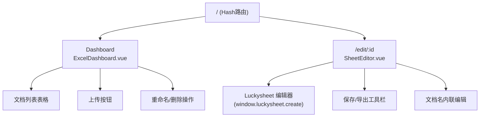

`SheetEditor.vue` 是核心页面，所有与 Luckysheet 的交互都在这里完成。页面加载后执行以下初始化流程：

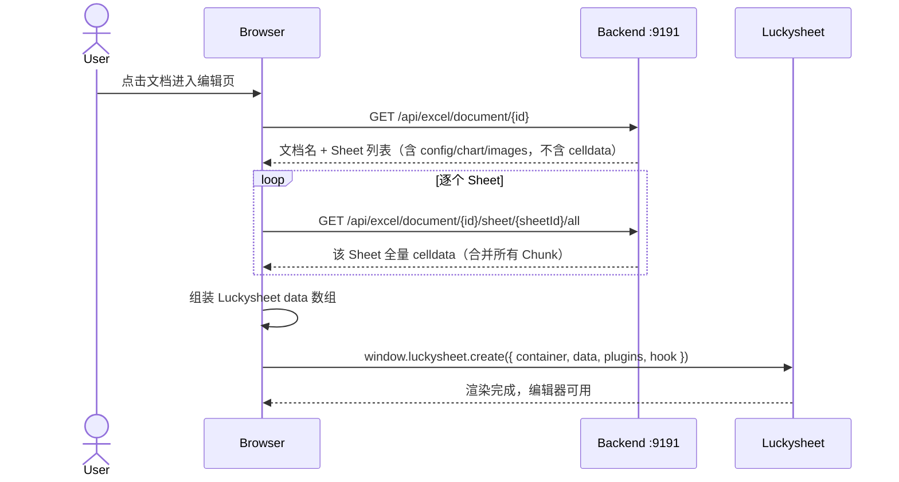

### 3.3 Luckysheet 初始化代码

```javascript
// SheetEditor.vue — initLuckysheet()
window.luckysheet.create({
  container: 'luckysheet-container',        // 挂载的 DOM 容器 ID
  lang: 'zh',                               // 中文界面
  showtoolbar: true,                        // 显示顶部工具栏
  showinfobar: false,                       // 隐藏信息栏
  showstatisticBar: true,                   // 显示底部统计栏
  allowUpdate: true,                        // 允许编辑
  forceCalculation: true,                   // 强制公式计算
  plugins: ['chart'],                       // 启用图表插件
  data: sheets.map((sheet, index) => ({     // ← 从后端加载的数据
    name: sheet.name,
    index: String(index),
    status: sheet.status ?? (index === 0 ? 1 : 0),
    order: index,
    celldata: sheet.celldata || [],          // 单元格数据 [{r,c,v},...]
    config: sheet.config || {},              // 合并单元格/列宽/行高
    hyperlink: sheet.hyperlink || {},        // 超链接配置
    images: sheet.images || {},              // 图片配置
    luckysheet_conditionformat_save: [],     // 条件格式
    chart: sheet.chart || []                 // 图表配置
  })),
  hook: {
    updated: () => { /* 工具栏操作 → 标记脏数据 */ },
    cellUpdated: (r, c, oldVal, newVal) => { /* 单元格编辑 → 记录脏坐标 */ },
    imageDeleteAfter: (img) => { /* 图片删除 → 清理内存残留 */ }
  }
})
```

初始化完成后，Luckysheet 内部将所有数据维护在 `ga.luckysheetfile` 这个全局数组中。后续的所有保存、导出、结构检测操作，都是从这个数组读取数据。

### 3.4 混合保存策略

这是最近一次重构的核心改进。在此之前，每次点"保存"都是全量快照保存——删除数据库里所有旧数据，重新逐 Sheet、逐 Chunk 写入。如果只有几个单元格发生变化，这个操作浪费了大量数据库 I/O。

新的保存流程引入了一个**结构快照机制**：初始化完成后拍一张"结构照片"，保存时对比当前状态与快照，自动选择增量保存还是全量保存。

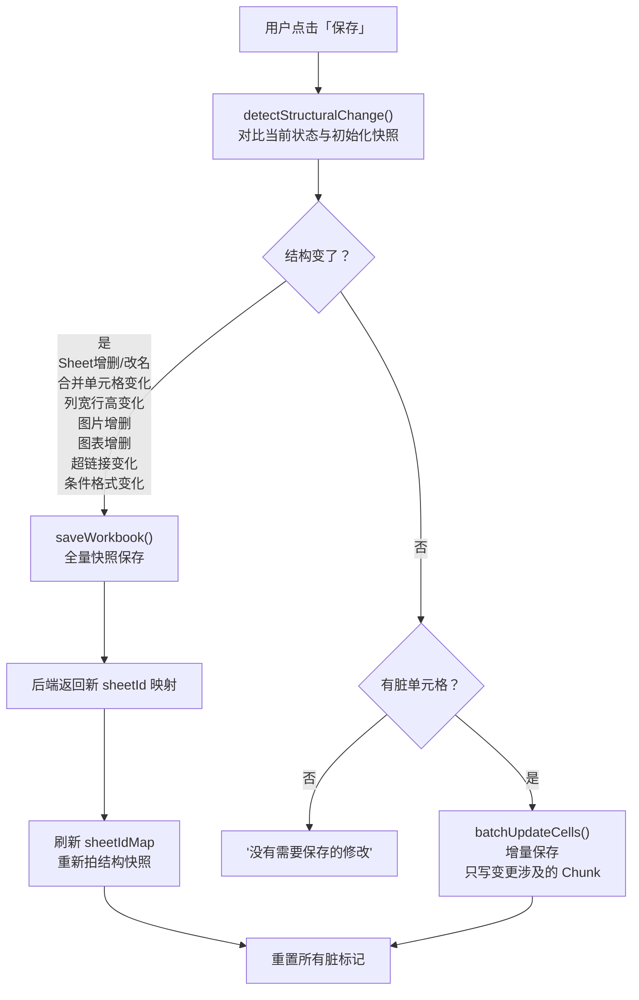

**结构快照**的本质是一组签名：

```javascript
function captureStructureSnapshot() {
  const files = luckysheet.getluckysheetfile()
  structureSnapshot = files.map(sheet => ({
    name: sheet.name,              // Sheet 名变化？
    index: sheet.index,
    status: sheet.status,          // 激活状态变化？
    order: sheet.order,            // 排序变化？
    configSig: stableJson(sheet.config || {}),       // 合并/列宽/行高？
    imagesSig: stableJson(sheet.images || {}),       // 图片增删？
    chartSig: stableJson(sheet.chart || []),         // 图表增删？
    hyperlinkSig: stableJson(sheet.hyperlink || {}), // 超链接变化？
    conditionFormatSig: stableJson(                  // 条件格式变化？
      sheet.luckysheet_conditionformat_save || []
    )
  }))
}
```

对比时逐字段比对，任何一个签名字符串不同，就判定为结构变化，走全量保存。全量保存完成后，后端返回新的 Sheet ID 映射表，前端刷新 `sheetIdMap`，保证后续增量保存的 `sheetId` 始终正确。

**效果对比：**

| 场景 | 修改前（仅全量） | 修改后（混合） |
|------|-----------------|---------------|
| 编辑 10 万行中的 1 个单元格 | 删所有 Chunk → 重建所有 Chunk | 定位 1 个 Chunk → 更新 1 个单元格 |
| 插入图片后保存 | 全量保存 | 全量保存（结构变了，必须的） |
| 多次编辑单元格不保存，最后一次性保存 | 全量保存 | 增量更新（按 Chunk 分组批量处理） |

### 3.5 前端导出机制

导出功能完全由前端 `ExcelJS` 库完成，不走后端。这不是技术上的限制，而是一个有意识的设计决策。

Luckysheet 在编辑器内部维护了两套数据：`celldata`（单元格的值对象）和 `data`（渲染矩阵）。`data` 是一个二维数组，每个元素包含了该单元格的完整渲染信息——字体族（`ff`）、字号（`fs`）、字体颜色（`fc`）、背景色（`bg`）、粗体（`bl`）、斜体（`it`）、下划线（`ul`）、删除线（`cl`）、垂直对齐（`vt`）、水平对齐（`ht`）、文字旋转（`tr`）、数字格式（`ct.fa`）等等。

后端数据库只存了 `celldata`，这是值对象（`v`、`m`、`ct`），不包含视觉样式。如果后端导出，必须从 `celldata` 反向重建所有样式，这在工程上几乎不可能做到 100% 还原。

前端导出直接从 `sheet.data` 读取，逐单元格写入 ExcelJS 的 `Worksheet`，效果与编辑器所见完全一致。

```mermaid
flowchart LR
    subgraph 前端导出
        A1["sheet.data 矩阵<br/>含完整样式信息"] --> B1["ExcelJS<br/>逐单元格还原"]
        B1 --> C1["下载 .xlsx<br/>样式零丢失"]
    end

    subgraph 后端导出(已废弃)
        A2["celldata 数组<br/>只有值，没有样式"] --> B2["POI/EasyExcel<br/>样式映射不完整"]
        B2 --> C2["导出文件<br/>格式丢失"]
    end
```

---

## 四、后端架构

### 4.1 接口全景

后端目前对外暴露 9 个 REST 接口，分布在两个 Controller 中：

| 接口 | 用途 | 调用时机 |
|------|------|----------|
| `POST /api/excel/upload` | 上传 Excel 文件，POI 解析后分块入库 | 用户上传文件 |
| `GET /api/excel/document/list` | 文档列表（分页，仅元数据） | Dashboard 页面加载 |
| `GET /api/excel/document/{id}` | 文档详情 + Sheet 元信息（含 config/chart/images） | 打开编辑页时 |
| `GET /api/excel/document/{id}/sheet/{sheetId}/all` | 加载 Sheet 全量 celldata | 编辑器初始化时懒加载 |
| `PUT /api/excel/document/{id}/cells/batch` | 批量增量更新单元格 | 混合保存时走此接口 |
| `PUT /api/excel/document/{id}/workbook` | 全量快照保存（事务替换） | 结构变更时走此接口 |
| `PUT /api/excel/document/{id}/name` | 重命名文档 | 列表页/编辑页重命名 |
| `DELETE /api/excel/document/{id}` | 删除文档（软删除 + 级联清理） | 列表页删除 |

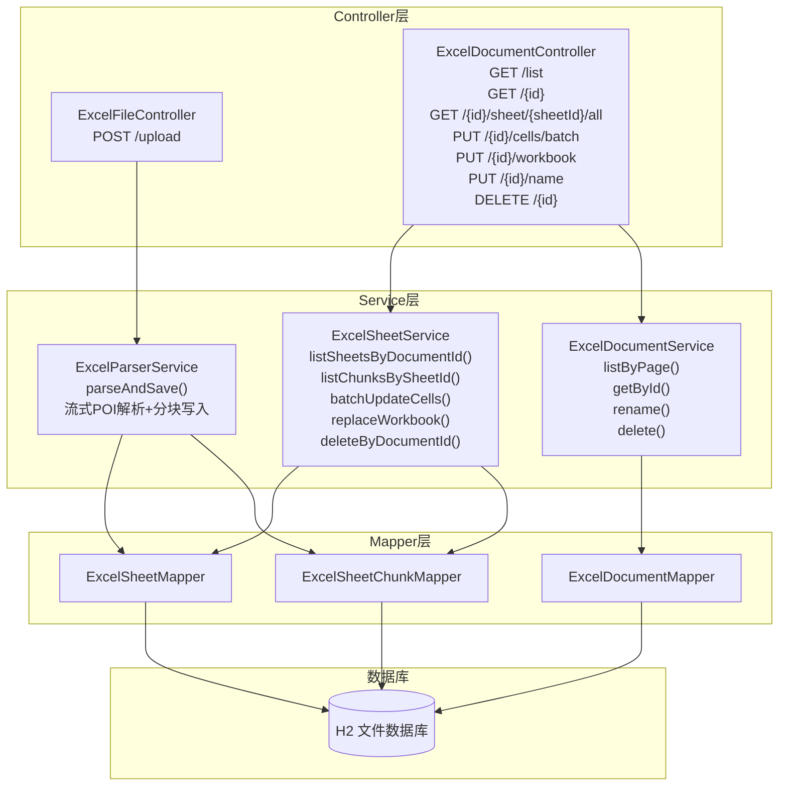

### 4.2 上传解析流程

上传是最复杂的后端操作。一个 `.xlsx` 文件上传后，经历以下处理链路：

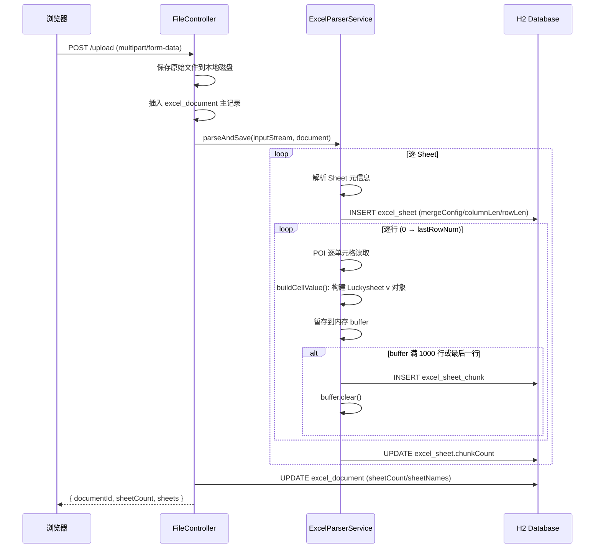

核心解析代码在 `ExcelParserService.parseAndSave()` 中：

```java
public static final int CHUNK_SIZE = 1000;

// 逐 Sheet 处理
for (int si = 0; si < sheetTotal; si++) {
    Sheet sheet = workbook.getSheetAt(si);

    // 第一步：保存 Sheet 元信息
    ExcelSheet sheetEntity = saveSheetMeta(sheet, document, si, sheetTotal);

    // 第二步：逐行解析单元格，按 1000 行分批写入 Chunk
    saveSheetChunks(sheet, workbook, sheetEntity);
}
```

`buildCellValue()` 方法根据 POI 单元格类型构建 Luckysheet 兼容的 `v` 对象：

```java
// 字符串类型 → {"v":"值","m":"值","ct":{"fa":"General","t":"s"}}
// 数字类型   → {"v":123.45,"m":"123.45","ct":{"fa":"General","t":"n"}}
// 日期类型   → {"v":"2024-01-15","m":"2024-01-15","ct":{"fa":"yyyy-MM-dd","t":"d"}}
// 布尔类型   → {"v":true,"m":"TRUE","ct":{"fa":"General","t":"b"}}
// 公式类型   → {"v":计算结果,"m":计算结果,"f":"=SUM(A1:A10)","ct":{"fa":"General","t":"n"}}
```

这个格式与 Luckysheet 内部 `celldata` 格式完全一致。前端拿到后可以直接喂给 `luckysheet.create()`，无需任何转换。

### 4.3 批量增量更新

`batchUpdateCells` 是混合保存策略中增量更新的核心。它与旧 `updateCell`（单单元格，已废弃）的区别在于：

1. 所有更新按 `(sheetId, chunkIndex)` 分组
2. 每组只读一次 Chunk、写一次 Chunk
3. 整个方法在 `@Transactional` 保护下执行

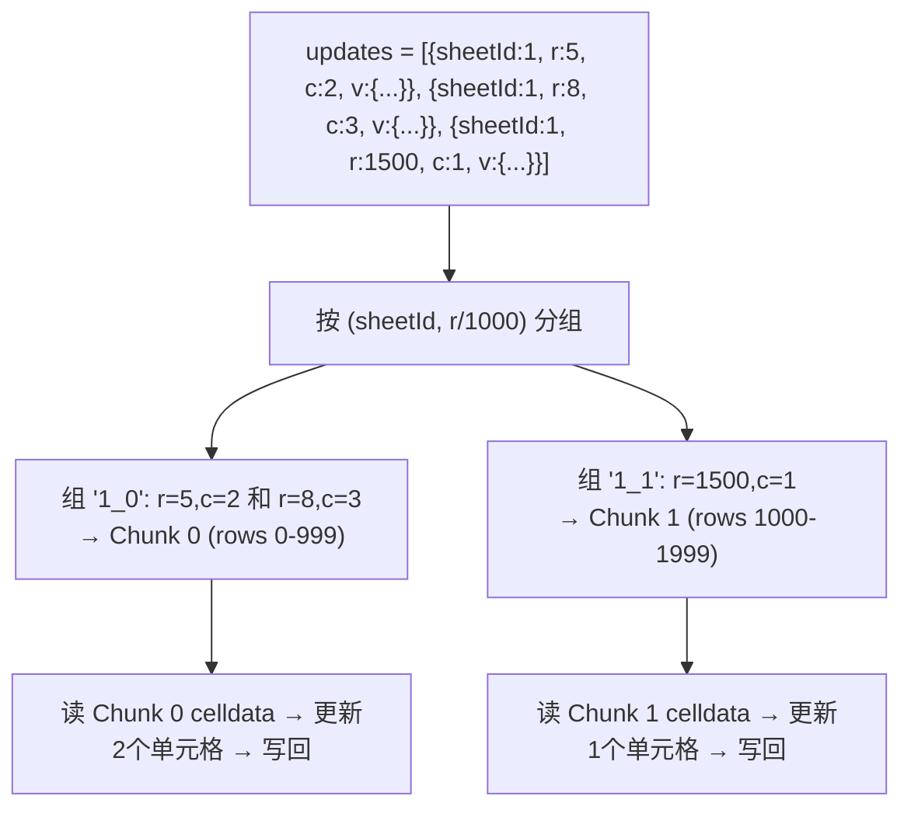

### 4.4 全量快照保存

当结构发生变化时（增删 Sheet、改名、合并单元格、列宽行高、图片图表变动），前端将整个 `getluckysheetfile()` 序列化后发送到后端，后端在一个事务内做全量替换：

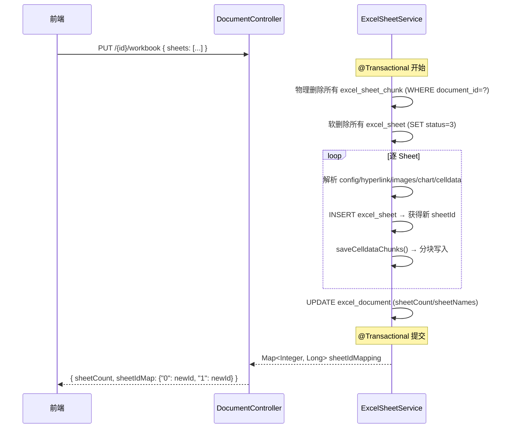

关键改动：`replaceWorkbook()` 返回值从 `void` 改为 `Map<Integer, Long>`，记录每个 sheetIndex 对应的新 Sheet ID。因为全量保存是删旧写新，旧 Sheet ID 全部失效，前端需要更新 `sheetIdMap` 才能保证后续增量保存的 `sheetId` 正确。

### 4.5 重命名功能

重命名是两个入口一个接口：

- **文档列表页**：点击「重命名」按钮 → `ElMessageBox.prompt` 弹窗 → 确认 → `PUT /{id}/name`
- **编辑页顶部**：直接点击文档名 → 内联 `<input>` 替换文本 → 回车/失焦确认 → `PUT /{id}/name`

后端逻辑很简单：

```java
@PutMapping("/{id}/name")
public ApiResponse<?> rename(@PathVariable Long id, @RequestBody Map<String, String> body) {
    String newName = body.get("name");
    if (newName == null || newName.trim().isEmpty()) {
        return ApiResponse.fail("名称不能为空");
    }
    documentService.rename(id, newName.trim());
    return ApiResponse.ok("重命名成功");
}
```

---

## 五、图表功能的血泪史

这是 DataLoom 开发过程中排查时间最长、根因最隐蔽的一个 Bug。从报错到最终修复，中间经历了 CDN 问题排查、Browser DevTools 断点调试、minified 源码逆向分析等多个阶段。

### 5.1 问题现象

一切看起来都正常。页面上传附件、在线编辑单元格、保存、导出都没问题。唯独点击 Luckysheet 工具栏上的「插入图表」按钮时，控制台无情地抛出：

```
plugin.js:1180 Uncaught TypeError: ga.createChart is not a function
```

翻遍 Luckysheet 的 GitHub Issues，没有找到确切答案。有人说是 CDN 版本问题，有人说是插件没加载，但具体怎么修没有定论。

### 5.2 从 minified 源码逆向追踪

错误发生在 `plugin.js:1180`，但 `plugin.js` 是 Luckysheet 的工具栏插件（实际上是 jQuery），它只是调用了 `ga.createChart`。真正的问题在 `luckysheet.umd.js` 这个 3 MB 的 minified 文件中。

通过 grep 搜索 `createChart`，找到了关键代码段：

```javascript
// luckysheet.umd.js 内部（反混淆还原后）
ga.createChart = chartmix.default.createChart;
ga.highlightChart = chartmix.default.highlightChart;
ga.deleteChart = chartmix.default.deleteChart;
// ... 更多赋值
```

这行代码在一个回调函数内部，而这个回调函数只有在 5 个 CDN 脚本**全部按顺序加载成功**后才会执行。

继续追踪，发现这 5 个脚本被硬编码在一个数组中：

```javascript
// luckysheet.umd.js 硬编码
var ch = [
  "https://cdn.jsdelivr.net/npm/vue@2.6.11",
  "https://unpkg.com/vuex@3.4.0",
  "https://cdn.bootcdn.net/ajax/libs/element-ui/2.13.2/index.js",
  "https://cdn.bootcdn.net/ajax/libs/echarts/4.8.0/echarts.min.js",
  "expendPlugins/chart/chartmix.umd.min.js"
];

var uh = [
  "https://cdn.bootcdn.net/ajax/libs/element-ui/2.13.2/theme-chalk/index.css",
  "expendPlugins/chart/chartmix.css"
];
```

加载这些脚本的函数是 `seriesLoadScripts`（在 minified 文件中叫 `Lm`）：

```javascript
function seriesLoadScripts(scripts, options, callback) {
    var s = [];
    var last = scripts.length - 1;
    var recursiveLoad = function(i) {
        s[i] = document.createElement("script");
        s[i].setAttribute("type", "text/javascript");
        s[i].onload = s[i].onreadystatechange = function() {
            // 加载成功 → 递归加载下一个
            if (i !== last) {
                recursiveLoad(i + 1);
            } else if (typeof callback === "function") {
                callback();  // ← 全部成功才执行
            }
        };
        // 注意：这里没有 s[i].onerror = ...
        s[i].setAttribute("src", scripts[i]);
        HEAD.appendChild(s[i]);
    };
    recursiveLoad(0);
}
```

这个函数有一个致命缺陷：**没有任何错误处理**。如果 `ch[0]` 加载失败，`recursiveLoad(1)` 永远不会被调用，回调永远不会执行，`ga.createChart` 永远是一个空字符串。

### 5.3 三层缺陷叠加

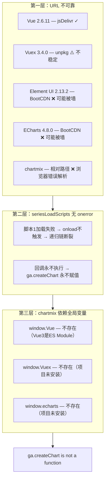

逐一分析这 5 个 URL 的问题：

1. **Vue 2.6.11 — jsDelivr**：这个通常是好的，jsDelivr 在国内有 CDN 节点，可以正常加载。
2. **Vuex 3.4.0 — unpkg**：unpkg 在某些网络环境下极慢，超时后 `onload` 不触发，链就断了。
3. **Element UI 2.13.2 — BootCDN**：`cdn.bootcdn.net` 是 BootCDN 的域名。在中国大陆部分运营商网络下，这个域名可能 DNS 解析失败或被墙。如果这个脚本 404/超时了，链就断了。
4. **ECharts 4.8.0 — BootCDN**：同上。
5. **chartmix — 相对路径 `"expendPlugins/chart/chartmix.umd.min.js"`**：这是最隐蔽的。相对路径被浏览器相对于当前页面 URL 解析。如果当前 URL 是 `http://localhost:8081/#/edit/4`，浏览器会向 `http://localhost:8081/expendPlugins/chart/chartmix.umd.min.js` 发请求，而这个路径不存在（文件在 `node_modules/luckysheet/dist/expendPlugins/...` 里）。结果 → 404 → 链断。

即使前 4 个脚本全部成功，第 5 个 chartmix 的相对路径 404 也足以让一切功亏一篑。

### 5.4 修复方案：preload + patch

最终采用了**双重修复**策略，一层治标、一层治本：

#### 第一重：index.html 预加载全部全局依赖

在 `luckysheet.umd.js` 加载之前，直接在 `index.html` 里用 `<script>` 标签按顺序加载全部 5 个图表依赖 + CSS。所有 URL 统一使用 jsDelivr CDN，版本号与 luckysheet 内部期望的完全一致：

```html
<script src="https://cdn.jsdelivr.net/npm/vue@2.6.11/dist/vue.min.js"></script>
<script src="https://cdn.jsdelivr.net/npm/vuex@3.4.0/dist/vuex.min.js"></script>
<script src="https://cdn.jsdelivr.net/npm/element-ui@2.13.2/lib/index.js"></script>
<script src="https://cdn.jsdelivr.net/npm/echarts@4.8.0/dist/echarts.min.js"></script>
<script src="https://cdn.jsdelivr.net/npm/luckysheet@2.1.13/dist/expendPlugins/chart/chartmix.umd.min.js"></script>
```

这样 `window.Vue`、`window.Vuex`、`window.echarts`、`window.chartmix` 在 luckysheet 脚本执行前已经全部就位。

#### 第二重：修补 luckysheet.umd.js

创建本地修补版 `public/lib/luckysheet.umd.js`，对原文件做三处关键修改：

1. **替换 BootCDN 为 jsDelivr**：`cdn.bootcdn.net` → `cdn.jsdelivr.net`
2. **替换相关路径为绝对路径**：`"expendPlugins/chart/..."` → 完整 jsDelivr URL
3. **替换 `ch` 数组为 data URI**：将整个 `ch` 数组替换为 `["data:application/javascript,"]`

```javascript
// 修补前
var ch = [
  "https://cdn.jsdelivr.net/npm/vue@2.6.11",
  "https://unpkg.com/vuex@3.4.0",
  "https://cdn.bootcdn.net/ajax/libs/element-ui/2.13.2/index.js",
  "https://cdn.bootcdn.net/ajax/libs/echarts/4.8.0/echarts.min.js",
  "expendPlugins/chart/chartmix.umd.min.js"
];

// 修补后
var ch = ["data:application/javascript,"];
```

`data:application/javascript,` 是一个空 data URI。浏览器加载它不需要任何网络请求，`onload` 瞬间触发。由于全部依赖已在 `index.html` 中预加载为全局变量，回调执行时直接从 `window` 读取，无需 luckysheet 再去动态加载。

**CSS 路径同样修补：**

```javascript
// 修补前
var uh = [
  "https://cdn.bootcdn.net/ajax/libs/element-ui/2.13.2/theme-chalk/index.css",
  "expendPlugins/chart/chartmix.css"
];

// 修补后
var uh = [
  "https://cdn.jsdelivr.net/npm/element-ui@2.13.2/lib/theme-chalk/index.css",
  "https://cdn.jsdelivr.net/npm/luckysheet@2.1.13/dist/expendPlugins/chart/chartmix.css"
];
```

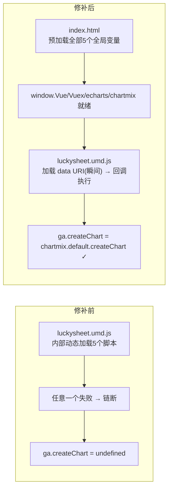

### 5.5 图表数据保存

图表创建后，Luckysheet 内部将图表信息保存在 `sheetFile.chart` 数组中：

```javascript
// luckysheet 内部 — 创建图表时
sheetFile.chart.push({
  chart_id: "chart_abc123",          // 随机生成的唯一 ID
  width: 400,
  height: 250,
  left: 100,
  top: 50,
  chartOptions: {                    // ECharts 完整配置
    chartAllType: "echarts|line|default",
    defaultOption: { /* ... */ },
    chartData: { /* 数据系列 */ }
  },
  sheetIndex: "0",
  needRangeShow: false
})
```

保存时通过 `serializeWorkbook()` 的 `...sheet` 展开操作，`chart` 数组随 Sheet 快照一起发送到后端，存入 `excel_sheet.chart_json`。下次打开文档时，后端返回 `chart` 数组，Luckysheet 调用 `renderCharts()` 逐个恢复图表 DOM。

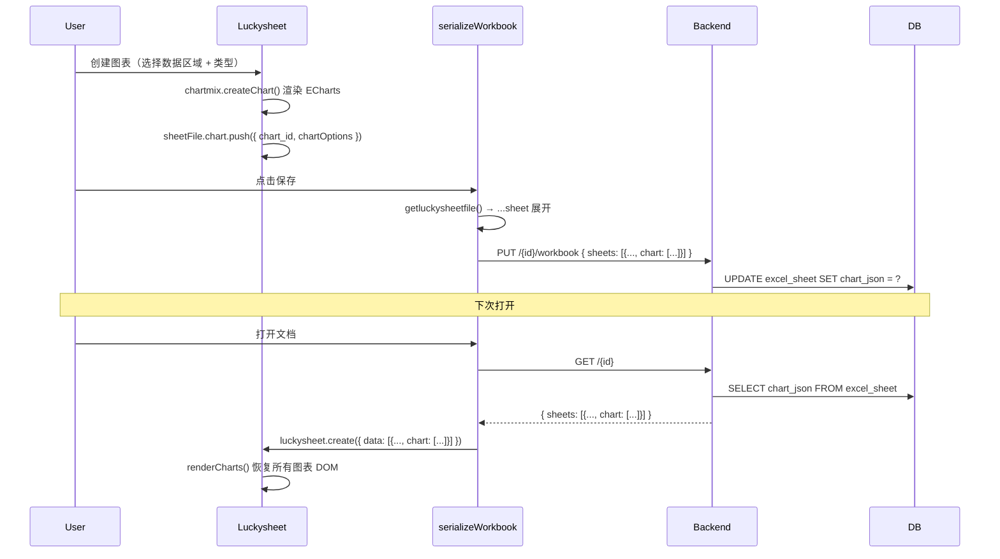

---

## 六、数据流转全链路

将前文的所有内容串联起来，下图展示了从上传到编辑到保存再到导出的完整数据流转：

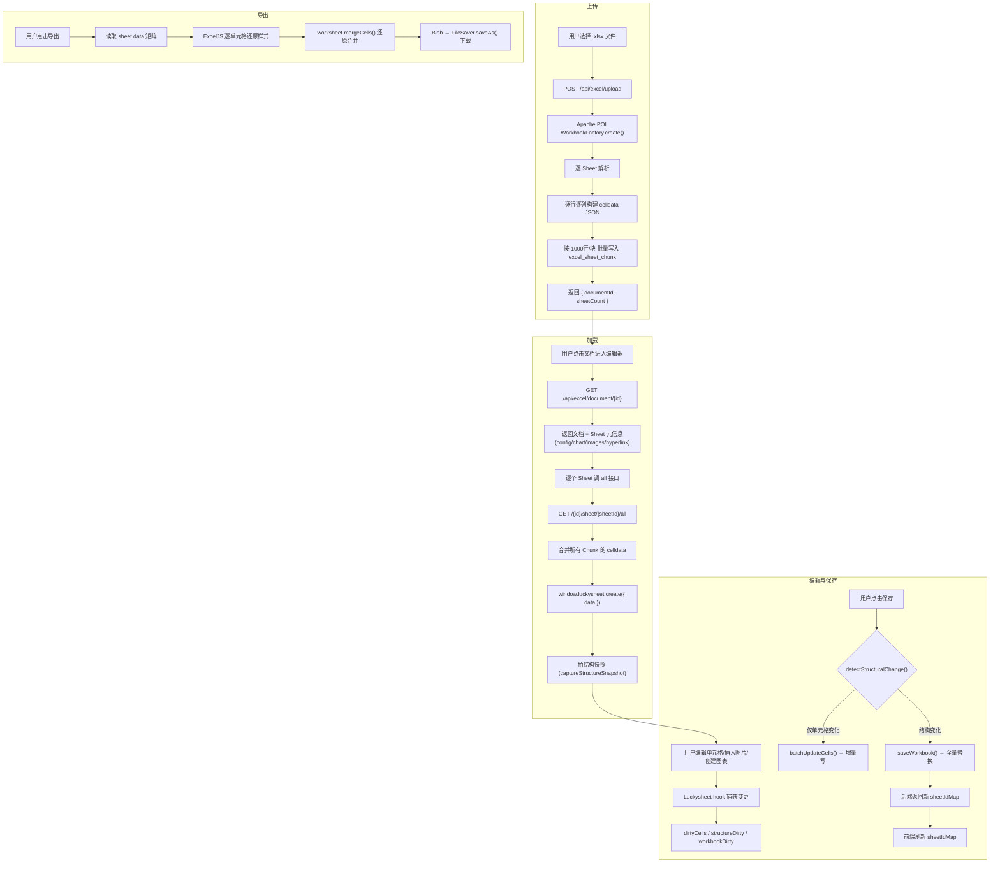

---

## 七、关键设计决策

### 7.1 为什么是 H2 而不是 MySQL

H2 的 File 模式将数据持久化到本地文件（默认 `./data/excel-demo.mv.db`），进程重启数据不丢失。对中小规模的内部系统来说，H2 的最大优势是**零运维成本**——不需要安装数据库服务，不需要配置连接池，不需要管理用户权限。启动 Spring Boot 应用，数据库就绪。

项目同时提供了 MySQL 建表语句（`schema.sql` 底部），换库只需修改 `application.yml` 的 datasource 配置和驱动依赖，表结构完全兼容。

### 7.2 为什么前端导出而不是后端导出

这是一个经过深思熟虑的决策，不是技术上的捷径。Luckysheet 编辑器内部维护了完整的样式状态（字体颜色、边框样式、背景色、对齐方式等），这些信息存在于前端内存的 `sheet.data` 矩阵中。后端数据库通过 `celldata` 格式只存储了单元格的**值**（v/m/ct），不存储渲染样式。如果后端导出，需要从 celldata 重建完整的样式映射，这在工程上不可靠。前端 `ExcelJS` 直接从编辑器内存状态导出，保证所见即所得。

### 7.3 为什么混合保存而不是全量保存

最初的全量保存直观且可靠，但 10 万行数据改一个单元格也要全量重建，I/O 开销巨大。混合保存保留了全量保存的可靠性（结构变更时仍然全量），同时在最常见的使用场景（编辑单元格）中获得了增量更新的性能。结构快照的成本是 O(Sheet 数 × 配置字段数)，通常在毫秒级，完全可接受。

---

## 八、踩过的坑

### 8.1 图表无法创建

**现象：** `ga.createChart is not a function`

**根因：** Luckysheet 2.1.13 内部图表插件加载依赖 5 个 CDN 脚本全部成功，但其中 3 个（ElementUI、ECharts、chartmix）使用了不可靠的 BootCDN 或相对路径，且 `seriesLoadScripts` 函数没有 `onerror` 处理。任意一个脚本加载失败，递归链断裂，`ga.createChart` 永不赋值。

**解决：** index.html 预加载全部全局依赖 + 本地修补 luckysheet.umd.js（替换所有 URL 为 jsDelivr，将 ch 数组替换为 data URI）。

### 8.2 图片删除残留

**现象：** 用户在编辑器中删除了图片，但保存后图片又出现了。

**根因：** Luckysheet 删除图片时销毁了 DOM 元素，但 `sheet.images` 对象中以 blob URL 为 key 的条目没有被及时清理。下次保存时，残留的图片数据又一起序列化到了后端。

**解决：** 在 `imageDeleteAfter` hook 中实现三重匹配删除——优先按图片 ID 匹配，其次按 src（Base64 内容）匹配，最后按坐标和尺寸相似度匹配。三重匹配确保无论 Luckysheet 内部以何种方式标识被删除的图片，都能清理干净。

### 8.3 大文件加载慢

**现象：** 早期版本中，10 万行的 Excel 打开需要几十秒，浏览器甚至卡死。

**根因：** 最初的设计把整表 celldata 存为单一 CLOB 字段。后端查出全部数据 → 发送到前端 → 前端解析大 JSON → 喂给 Luckysheet。任何一个环节都可能是瓶颈。

**解决：** 重构为分块存储（1000 行/块）。虽然前端目前仍然使用 `all` 接口一次性加载全部 celldata（对于小文件足够了），但分块架构为未来的按需懒加载和虚拟滚动铺平了道路。

### 8.4 Luckysheet 资源冲突

**现象：** Vue 路由切换后再进入编辑页，Luckysheet 工具栏出现两份，或者报 "container already initialized" 错误。

**根因：** Luckysheet 是全局单例。Vue Router 的 `<keep-alive>` 或路由切换时，旧的 Luckysheet 实例没有被销毁，新的 `create()` 调用在同一个容器上叠加。

**解决：** 在 `initLuckysheet()` 开始时先调用 `window.luckysheet.destroy?.()` 清理旧实例，`onBeforeUnmount` 中也做一次销毁。

---

## 九、项目结构

```
DataLoom/
├── docs/
│   └── DataLoom-系统架构与技术实践.md
│
├── dataloom-server/                              # Spring Boot 后端
│   ├── pom.xml
│   └── src/main/
│       ├── java/com/demo/excel/
│       │   ├── ExcelServiceApplication.java       # Spring Boot 入口
│       │   ├── common/
│       │   │   └── ApiResponse.java               # 统一响应格式 {success, message, data}
│       │   ├── config/
│       │   │   ├── CorsConfig.java                # CORS 跨域配置
│       │   │   └── MybatisPlusMetaHandler.java    # 自动填充 createTime/updateTime
│       │   ├── controller/
│       │   │   ├── ExcelFileController.java       # 文件上传
│       │   │   └── ExcelDocumentController.java   # 文档 CRUD + 保存 + 单元格写入
│       │   ├── entity/
│       │   │   ├── ExcelDocument.java             # 文档实体
│       │   │   ├── ExcelSheet.java                # Sheet 实体（含 chart/images 等 JSON 字段）
│       │   │   └── ExcelSheetChunk.java           # 数据分块实体
│       │   ├── mapper/
│       │   │   ├── ExcelDocumentMapper.java
│       │   │   ├── ExcelSheetMapper.java
│       │   │   └── ExcelSheetChunkMapper.java
│       │   └── service/
│       │       ├── ExcelParserService.java        # POI 解析引擎 + 分块写入
│       │       ├── ExcelSheetService.java         # Sheet/Chunk 读写 + 混合保存
│       │       └── ExcelDocumentService.java      # 文档基础 CRUD
│       └── resources/
│           ├── application.yml                    # 端口 9191, H2 文件模式
│           └── schema.sql                         # H2 + MySQL 双版建表语句
│
├── dataloom-web/                                  # Vue 3 前端
│   ├── package.json
│   ├── vite.config.js                             # 端口 8081, /api 代理到 9191
│   ├── index.html                                 # CDN 依赖加载 + 图表预加载
│   ├── public/lib/
│   │   └── luckysheet.umd.js                      # 修补版 luckysheet（URL 修复）
│   └── src/
│       ├── main.js                                # Vue 3 + Element Plus + Router
│       ├── App.vue                                # 根组件 <router-view>
│       ├── router/index.js                        # Hash 路由: / 和 /edit/:id
│       ├── api/excel.js                           # Axios API 封装（8个函数）
│       ├── utils/export.js                        # ExcelJS 前端导出（样式零丢失）
│       ├── views/
│       │   ├── ExcelDashboard.vue                 # 文档列表页（上传/重命名/删除）
│       │   └── SheetEditor.vue                    # 编辑器页（核心，含混合保存）
│       └── styles/app.css                         # 全局样式 + CSS 变量
│
├── luckysheet-vue3-vite/                          # Luckysheet 官方 Vue3 Demo（参考）
└── README.md
```

---

## 十、高级元素（图片与图表）的存储机制与后续优化

### 10.1 当前的纯文本宽表直存方案

在现阶段的架构中，对于在线表格中插入的**图片（images）**和**图表（chart）**，后端的保存机制非常纯粹：**作为宽表的大字段（JSON 字符串）直接落库**。

在 `excel_sheet` 表中，专门开辟了两个 `CLOB`（在 MySQL 中为 `LONGTEXT`）类型的字段：
- `images_config_json`：存放全部图片配置
- `chart_json`：存放全部图表配置

**工作流：**
1. **图片数据：** 前端 Luckysheet 默认将图片转为 Base64 编码的超长字符串，连同宽、高、位置偏移量等属性打包成一个巨大的 JSON 对象。
2. **图表数据：** 是一组包含图表类型、数据范围、ECharts 坐标轴样式、图例样式（如 `chartOptions` 等）的复杂 JSON 数组。
3. **接口流转：** 点击保存时，前端将完整的 JSON Payload 发送给后端。后端在 `ExcelSheet` 实体类中将其直接映射为 `String`，不进行任何拆解关联，原封不动地存储进 H2 数据库的大字段中。
4. **渲染还原：** 打开文档时，后端将长文本取出，反序列化后交给前端，前端便可 1:1 像素级复现原本的图表和图片。

**优势：** 开发成本极低，天然保持了插件原本复杂嵌套结构的完整性。

### 10.2 后续优化方案：物理抽离与对象存储

虽然直存方案简单高效，但在面对真实业务场景时会遇到致命瓶颈：**数据库体积膨胀**。由于一张高清图片转为 Base64 后体积巨大，如果有用户插入几十张图片，`images_config_json` 这个单字段的大小可能会达到几十甚至上百 MB，不仅挤爆关系型数据库，还会导致严重的网络传输延迟和 JSON 解析内存溢出（OOM）。

为此，后续规划了以下彻底的存储优化路径：

#### 方案 A：图片数据的分离落盘（OSS / 物理存储）
这是必须执行的重构优化：
1. **重写前端插入逻辑：** 拦截 Luckysheet 原生的插入图片动作。不再让其转为 Base64 嵌在 JSON 中，而是直接通过 `FormData` 将文件实体上传给后端专门的 `/api/upload` 接口。
2. **后端文件落盘：** 后端接收图片文件，将其存储在本地服务器的物理目录（如 `./upload/images/`）或上传至第三方对象存储（如阿里云 OSS、AWS S3），并返回一个可访问的 HTTP 图片 URL。
3. **轻量化 JSON：** 前端接收到 URL 后，在 `images` 对象中只存储这个图片的 URL 地址以及宽高和坐标位置。
4. **效果预期：** `images_config_json` 的体积将从几十 MB 锐减到几十 KB，数据库彻底从“图片存储中心”的苦力活中解放出来。

#### 方案 B：图表大数据的引用隔离
图表的配置信息（坐标系、颜色等）通常只有几 KB，作为 JSON 存在数据库中完全合理。但如果图表引用了庞大的表格数据集（`seriesData` 中有上万个数据点），图表 JSON 的体积依然会非常可观。
1. **引用化改造：** 剥离 `chart_json` 中冗余的图表元数据。图表内不再硬编码保存庞大的 `seriesData` 数组，而是只保留 `rangeTxt`（数据在表格中的引用范围，如 `B2:C1000`）。
2. **动态渲染：** 每次前端加载图表时，根据 `rangeTxt` 去表格的分块数据（`celldata_json`）中实时提取数据进行渲染，实现“配置与数据分离”。

---

## 十一、总结

DataLoom 是一个从零开始构建的在线 Excel 系统。从最初的上传解析、到分块存储解决大文件性能、到混合保存策略减少 I/O、到图表功能的深度排查和修复——每一步都是在实际使用中发现问题、解决问题的过程。

如果把整个项目浓缩成几个关键决策，它们应该是：

1. **分块 1000 行** — 核心架构决策，决定了系统的性能上限
2. **前端 ExcelJS 导出** — 因为后端拿不到样式，所以导出必须在线编辑器侧完成
3. **H2 嵌入式数据库** — 牺牲集群能力换取零运维成本
4. **混合保存策略** — 结构变动走全量，只有数据变动走增量，兼顾可靠性和性能
5. **图表双重修复** — 预加载 + 修补，把外部依赖的不可控因素降到最低

图表问题的调试经历是一个深刻的提醒：**当你依赖一个不透明的第三方库，而它的内部加载链路有 5 个环节、没有错误反馈机制时，排查可能需要深入到 minified 源码级别。** 浏览器的 Network 面板只能告诉你「这个脚本 404 了」，但不会告诉你它导致了哪些连锁后果。最终的修复策略——预加载全局依赖 + 替换内部加载数组为 data URI——将脆弱的 CDN 链变成了确定性的加载行为。

---

*最后更新：2026 年 6 月*
